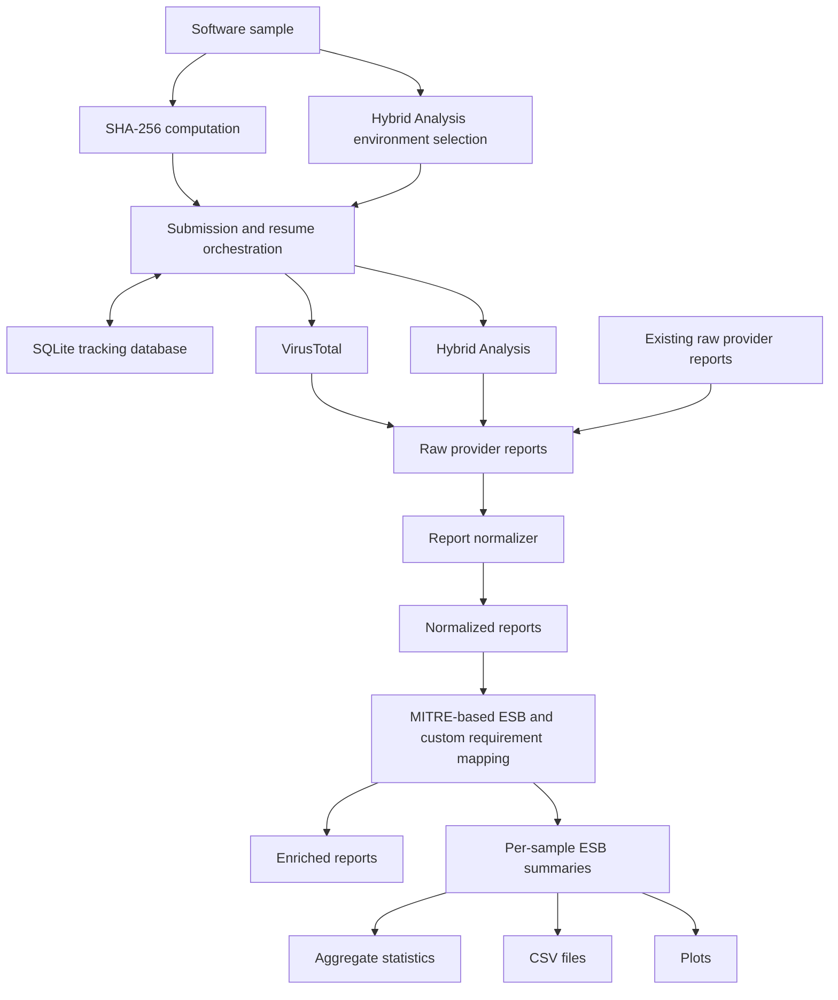

# BEHAVE

A tool for collecting, normalizing, enriching, and analyzing equivocal behavioral evidence from heterogeneous software-analysis sources.

BEHAVE supports the analysis of Equivocal Software Behaviors (ESBs), i.e., behaviors that are not necessarily malicious in isolation, but may raise uncertainty about software goals, privacy, or security when left unexplained. The tool integrates evidence from VirusTotal and Hybrid Analysis reports, normalizes provider-specific outputs, maps MITRE ATT&CK techniques to ESB categories, and generates per-sample summaries and aggregate statistics.

## Table of Contents

* BEHAVE architecture
* Using Command Line Interface
* Replication mode
* Online collection mode
* Notice
* License
* Related tools
* References

## BEHAVE architecture

BEHAVE encompasses five main software components:

1. the Submission and Collection component submits software samples to supported analysis providers and retrieves raw reports;
2. the Local Tracking component stores file hashes, provider identifiers, submission status, and Hybrid Analysis environment identifiers in a SQLite database;
3. the Normalizer converts provider-specific reports into a common JSON representation;
4. the ESB Mapper extracts MITRE ATT&CK-based evidence and maps it to Equivocal Software Behavior categories;
5. the Statistics component generates per-sample summaries, aggregate CSV files, textual summaries, and plots.



In general, BEHAVE supports two main execution modes:

* the replication mode, in which already collected raw reports are processed to regenerate normalized reports, enriched reports, ESB summaries, CSV files, and plots;
* the online collection mode, in which software samples are submitted to VirusTotal and Hybrid Analysis and the resulting reports are collected and processed.

The recommended path for reproducing an analysis is the replication mode, because it does not require re-submitting binaries to external services and does not depend on API quota availability at execution time.

The detailed technical documentation is available in:

```text
Guide.md
```

## Using Command Line Interface

Please clone the BEHAVE repository in a local folder of your choice.

BEHAVE requires:

* Python 3.10 or higher;
* the Python dependencies declared in `pyproject.toml`;
* a VirusTotal API key, only for online collection mode;
* a Hybrid Analysis API key, only for online collection mode.

Install the tool in editable mode:

```bash
python -m pip install -e .
```

The command-line interface can be invoked with:

```bash
python -m toolbehave.cli --help
```

If the console entry point is available, the following command is equivalent:

```bash
toolbehave --help
```

The main commands are:

```text
submit         Submit or resume submission for one sample
list           List all submissions stored in the local database
poll           Poll status once for one SHA-256
poll-all       Poll status once for all SHA-256 values in the database
watch          Continuously poll all submissions
report         Fetch raw reports for one SHA-256
report-all     Fetch raw reports for all known SHA-256 values
normalize-all  Normalize all raw reports
eb-all         Generate enriched reports and ESB summaries
eb-summary     Print compact per-sample ESB summaries
eb-stats       Generate aggregate ESB statistics and plots
run            Execute the full online pipeline for one sample
```

## Replication mode

The replication mode starts from already collected raw reports.

The expected input layout is:

```text
reports/
  raw/
    raw_<sha256>.json
```

The replication workflow is:

```text
raw provider reports
    |
    | normalize-all
    v
normalized reports
    |
    | eb-all
    v
enriched reports + ESB summaries
    |
    | eb-stats
    v
plots + CSV statistics
```

To regenerate normalized reports:

```bash
python -m toolbehave.cli normalize-all --reports-dir reports
```

This command reads:

```text
reports/raw/raw_<sha256>.json
```

and writes:

```text
reports/normalized/normalized_<sha256>.json
```

To generate enriched reports and compact ESB summaries:

```bash
python -m toolbehave.cli eb-all --reports-dir reports
```

This command reads:

```text
reports/normalized/normalized_<sha256>.json
```

and writes:

```text
reports/enriched/enriched_<sha256>.json
reports/eb/eb_<sha256>.json
```

To generate aggregate statistics and plots:

```bash
python -m toolbehave.cli eb-stats --reports-dir reports
```

To generate aggregate statistics grouped by operating system:

```bash
python -m toolbehave.cli eb-stats --reports-dir reports --by-os
```

The generated outputs are written under:

```text
reports/
  normalized/
  enriched/
  eb/
  plots/
```

The OS-aware statistics use the Hybrid Analysis `environment_id` stored in the SQLite database. The current mapping is:

```text
140 -> windows
330 -> linux
430 -> macos
```

If the database is not available, global statistics can still be regenerated from the ESB summaries, while OS-aware grouping may fall back to `unknown`.

## Online collection mode

The online collection mode submits software samples to the supported analysis providers and processes the resulting reports.

For this mode, create a `.env` file in the repository root:

```env
VT_API_KEY=<VirusTotal API key>
HA_API_KEY=<Hybrid Analysis API key>
```

A running example for one Windows sample is reported below:

```bash
python -m toolbehave.cli run samples/Windows/sample.exe \
    --reports-dir reports \
    --poll-every 120 \
    --timeout 7200
```

The `run` command performs the following steps:

1. computes the SHA-256 hash of the input sample;
2. reuses existing submissions from the SQLite database when available;
3. submits the sample to VirusTotal and Hybrid Analysis when needed;
4. polls both providers until completion;
5. retrieves raw reports;
6. normalizes provider-specific evidence;
7. maps MITRE ATT&CK techniques to ESB categories;
8. writes enriched reports and per-sample ESB summaries.

Hybrid Analysis environments are selected according to file extension:

```text
Windows / PE-like files: .exe, .dll, .sys, .scr, .ocx, .cpl, .drv, .efi, .msi -> 140
Linux / ELF-like files: .elf, .so, .bin, .run, .out -> 330
macOS files: .macho, .dylib, .app, .pkg, .dmg -> 430
```

If a sample has an unsupported extension, BEHAVE stops before submitting it to Hybrid Analysis.

To force re-submission and regenerate the outputs:

```bash
python -m toolbehave.cli run samples/Windows/sample.exe \
    --reports-dir reports \
    --poll-every 120 \
    --timeout 7200 \
    --force
```

## Equivocal Software Behavior mapping

BEHAVE maps MITRE ATT&CK techniques to twelve ESB categories.

The default ESB definitions are stored in:

```text
src/resources/Equivocal_Behaviours.json
```

The compact code mapping is stored in:

```text
src/resources/code_mappings.json
```

The current ESB codes are:

```text
ESB1   System Analysis and Resource Discovery
ESB2   Network Enumeration and Analysis
ESB3   Network Traffic Manipulation and Covert Communications
ESB4   Scripting and Code Execution
ESB5   Task Scheduling and System Automation
ESB6   Advanced OS Utility Exploitation
ESB7   Privilege Manipulation
ESB8   Software Extension and Interaction
ESB9   Control Evasion and Analysis Avoidance
ESB10  Logging Evasion and Indirect Software Execution
ESB11  Encryption Manipulation
ESB12  Media Capture
```

An ESB is triggered when at least one associated MITRE ATT&CK technique is observed in the normalized provider evidence.

The generated ESB summary for each sample is written to:

```text
reports/eb/eb_<sha256>.json
```

Each ESB summary contains:

```text
sha256
triggered ESB codes
ESB names
sources that triggered each ESB
matched MITRE techniques
source-level counts
optional custom requirements
```

## Custom requirements

BEHAVE can evaluate custom behavioral requirements in addition to the default ESB taxonomy.

A custom requirements file is a JSON object that maps requirement names to MITRE ATT&CK technique identifiers.

Example:

```json
{
  "REQ - Network Discovery": ["T1016", "T1049"],
  "REQ - Command Execution": ["T1059"]
}
```

To generate ESB summaries with custom requirements:

```bash
python -m toolbehave.cli eb-all \
    --reports-dir reports \
    --requirements src/resources/my_requirements.json
```

To run the full online pipeline with custom requirements:

```bash
python -m toolbehave.cli run samples/Windows/sample.exe \
    --reports-dir reports \
    --poll-every 120 \
    --timeout 7200 \
    --requirements src/resources/my_requirements.json
```

Custom requirements are encoded as `R1`, `R2`, and so on, according to the order of the entries in the JSON file. The generated reports also store requirement schema metadata, so that requirement codes can be interpreted with respect to the file that produced them.

## Notice

Python 3.10 or higher is required to run the tool.

API keys are required only for commands that communicate with VirusTotal or Hybrid Analysis, such as `submit`, `run`, `poll`, `report`, and `report-all`.

API keys are not required to regenerate normalized reports, ESB summaries, aggregate CSV files, or plots from already collected raw reports.

BEHAVE is not a malware detector. It does not assign definitive maliciousness labels. It supports the systematic identification and measurement of equivocal behavioral evidence that must be interpreted in context.

This tool may process malware, potentially unwanted programs, or other security-sensitive binaries. It should be used only in controlled research environments. Unknown samples should not be executed on a host system outside an appropriate sandbox. The online collection mode submits files to third-party services; therefore, confidential, proprietary, personal, or otherwise sensitive files should not be submitted unless this is explicitly permitted by the relevant data governance policy.

## License

BEHAVE is distributed under the license specified in the `LICENSE` file.

## Related tools

BEHAVE relies on reports produced by external software-analysis services. It does not replace such services; instead, it integrates their outputs, normalizes provider-specific evidence, and summarizes ESB-related observations across sources.

The current implementation supports:

* VirusTotal;
* Hybrid Analysis.

BEHAVE also provides a local SQLite-based tracking mechanism to make submissions resumable and to avoid unnecessary API usage when an analysis has already been collected.

## References

If you use this tool in your research, please cite:
[THIS IS è PLACEHOLDER]
```bibtex
@inproceedings{behave2026,
  title     = {BEHAVE: amBiguous and Equivocal beHAviors Verification Engine},
  author    = {Anonymous},
  booktitle = {Proceedings of the IEEE International Conference on Software Maintenance and Evolution},
  year      = {2026}
}
```
